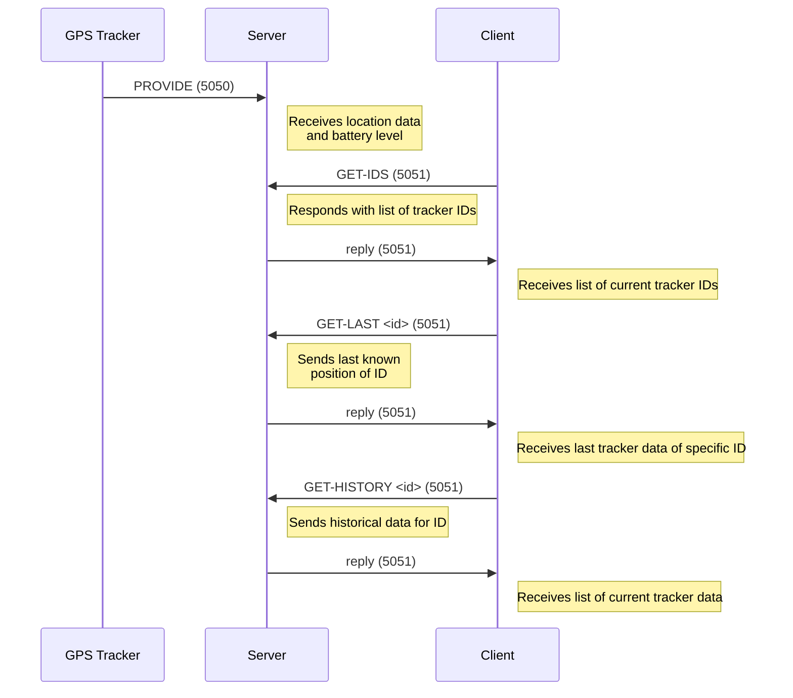
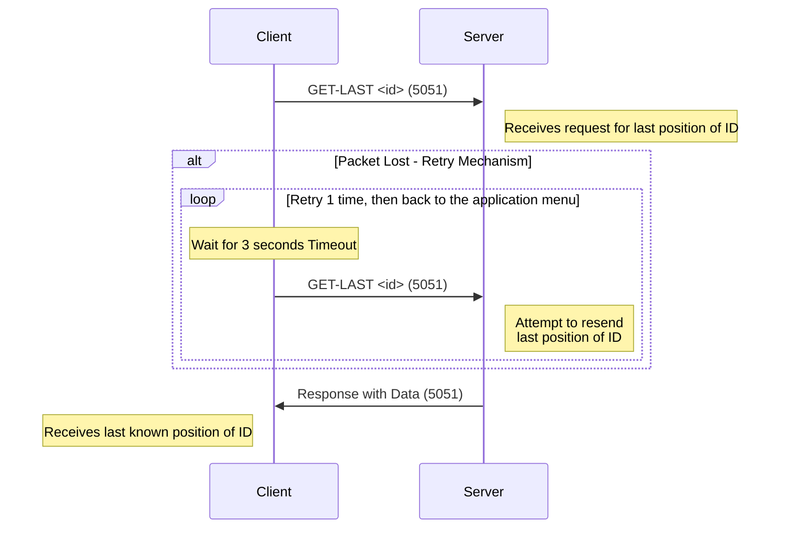

# DAI-2023-24-Practical-work-3 Java UDP programming

* Lucas Lattion
* Romain Humair

# GPS Tracker

## How to build the application

first, clone the repository.

Then, you have two possibilities to build the jar file:
1. IntelliJ
    2. select "Maven Package as JAR file" on top right of IntelliJ
    3. click "Run" button
2. command line in the project folder
    3. ```mvn dependency:resolve clean compile package```


JAR file will be generated in the /target/ folder

## How to use the CLI application

With the CLI there is 3 differents endpoints you can start: "tracker-gps","server" and "client".

There is also a command to get the network interface list.

### Get the "list-network-interfaces"

cmd
```
java -jar java-udp-programming-1.0-SNAPSHOT.jar list-network-interfaces
```
result example
```
Network interface: VMware Virtual Ethernet Adapter for VMnet8
Network interface: VirtualBox Host-Only Ethernet Adapter
Network interface: VirtualBox Host-Only Ethernet Adapter #2
Network interface: VirtualBox Host-Only Ethernet Adapter
Network interface: VMware Virtual Ethernet Adapter for VMnet1
Network interface: Intel(R) Wi-Fi 6E AX211 160MHz
```


### Start the "tracker-gps"

The minimum parameter is "tracker-gps", host that represent the multicast address and the interface to use.

frequency and delay are optionals.

cmd
```
java -jar java-udp-programming-1.0-SNAPSHOT.jar tracker-gps -d 0 -f 3000 -H 239.1.1.1 -i "Intel(R) Wi-Fi 6E AX211 160MHz" -p 5050
```
result
```
Tracker GPS Multicast emitter started (192.168.1.72:5050) with id 173395488849584
multicast address is /239.1.1.1
Multicasting 'PROVIDE:173395488849584,1702977272676,46.1027,-101.4446,1' to 239.1.1.1:5050 on interface Intel(R) Wi-Fi 6E AX211 160MHz
Payload size : 57
```

### Start the "server"

The minimum parameter is "server", host that represent the multicast address, the interface to use, the multicast port number and the unicast port number.

cmd
```
java -jar java-udp-programming-1.0-SNAPSHOT.jar server -H 239.1.1.1 -i "Intel(R) Wi-Fi 6E AX211 160MHz" -pm 5050 -pu 5051
```
result
```
Multicast receiver started (192.168.1.72:5050)
Unicast receiver started (192.168.1.72:5051)
Multicast receiver (192.168.1.72:5050) received message: PROVIDE:575092613358217,1702978328231,49.4792,-80.9773,23
Data received from tracker : TrackerData{trackerId='575092613358217', timestamp=1702978328231, latitude=49.4792, longitude=-80.9773, batteryLevel=23}
Unicast receiver (192.168.1.72:5051) received message: GET-IDS:
```

### Start the "client"

The minimum parameter is "client", host that represent the unicast address.

There is a default port, therefore it is recommanded to define the port to have a working environement.

cmd
```
java -jar java-udp-programming-1.0-SNAPSHOT.jar client -H localhost -p 5051
```
result
```
Unicast emitter started (192.168.1.72:5051)
Menu:
1. GET-LAST (Get the last position of an ID)
2. GET-HISTORY (Get the history of positions for an ID)
3. GET-ALL (Get last positions of all trackers)
4. GET-IDS (Get the list of IDs on the server)
0. Quit
Choose an option:
```


### Help
cmd
```
java -jar java-udp-programming-1.0-SNAPSHOT.jar -h
```
result
```
Usage: java-udp-programming-1.0-SNAPSHOT.jar [-hV] [-p=<port>] [COMMAND]
Practical content of the Java UDP programming chapter
  -h, --help          Show this help message and exit.
  -p, --port=<port>   Port to use (default: 9876).
  -V, --version       Print version information and exit.
Commands:
  list-network-interfaces  List all available network interfaces
  tracker-gps              Start an UDP GPS tracker unicast emitter client
  server                   Start an UDP server (unicast and multicast)
  client                   Start an UDP GPS tracker unicast emitter client
```

## Docker and docker compose

### How to build the image

powershell
```

docker build -t dai-java-udp-tracker-gps .
```

### How to build and publish the image

powershell
```
# Build the image with the dai-java-udp-tracker-gps tag
docker build -t dai-java-udp-tracker-gps .

# Start the image with the dai-java-udp-tracker-gps tag
docker run dai-java-udp-tracker-gps

# Tag the image with the correct format to be published
docker tag dai-java-udp-tracker-gps ghcr.io/lucaslattion/dai-java-udp-tracker-gps

# verify the tag by displaying all the images
docker images

# Publish the image on GitHub Container Registry
docker push ghcr.io/lucaslattion/dai-java-udp-tracker-gps

# Start the image with the ghcr.io/lucaslattion/dai-java-udp-tracker-gps tag
docker run ghcr.io/lucaslattion/dai-java-udp-tracker-gps
```


## The protocol

### Section 1 - Overview
This protocol outlines the communication for a GPS tracking system using UDP. It involves the exchange of GPS data between trackers, a server, and clients. The system is designed to efficiently transmit real-time and historical location data, including timestamps, latitude, longitude, and battery levels.

- Tracker-GPS --> Server <--> Client

### Section 2 - Transport Protocol
The system uses the User Datagram Protocol (UDP) due to its low latency and efficiency. The following UDP ports are designated by default for communication:
- **Tracker to Server Port:** 5050 (used by GPS trackers to send data to the server)
- **Client to Server Port:** 5051 (used by clients to send requests to the server and by server to reply)

ports be changed. use the cmd `--help` for more information


### Section 3 - Messages
#### GPS-Tracker to Server
The tracker send message 
- **PROVIDE Message:**
   - **Format:** `PROVIDE:ID,timestamp,latitude,longitude,battery_level`
   - **Example:** `PROVIDE:1234,20231218T123000Z,37.7749,-122.4194,85`


#### Client to Server
- **GET-IDS Message:** list of all trackers ID stored on the server
    - **Format:** `GET-IDS:`

    - **REQUEST** 
    ```
    GET-IDS:
    ```
    - **RESPONSE** 
    ```
   IDS:
    245160350818314
    597968797216796
    673352503620987
    945983442423128
    ```
- **GET-LAST Message:** last data from a specific tracker (ID)
    - **Format:** `GET-LAST: <ID>`
    - **REQUEST** 
    ```
    GET-LAST:673352503620987 
    ```
    - **RESPONSE** 
    ```
   TrackerData{trackerId='673352503620987', timestamp=1702957396983, latitude=50.5579, longitude=-88.518, batteryLevel=17}
    ```
- **GET-HISTORY Message:** all data from a specific tracker (ID)
    - **Format:** `GET-HISTORY: <ID>`
    - **REQUEST** 
    ```
    GET-HISTORY:673352503620987
    ```
    - **RESPONSE** 
    ```
   HISTORY:
    TrackerData{trackerId='673352503620987', timestamp=1702957301992, latitude=52.6475, longitude=-90.7085, batteryLevel=23}
    TrackerData{trackerId='673352503620987', timestamp=1702957306974, latitude=44.985, longitude=-111.787, batteryLevel=43}
    TrackerData{trackerId='673352503620987', timestamp=1702957311974, latitude=55.3323, longitude=-90.7589, batteryLevel=14}
    TrackerData{trackerId='673352503620987', timestamp=1702957316977, latitude=49.6168, longitude=-100.9021, batteryLevel=44}
    TrackerData{trackerId='673352503620987', timestamp=1702957321979, latitude=43.1958, longitude=-102.6128, batteryLevel=30}
    TrackerData{trackerId='673352503620987', timestamp=1702957326976, latitude=53.781, longitude=-80.1177, batteryLevel=64}
    TrackerData{trackerId='673352503620987', timestamp=1702957331985, latitude=55.2012, longitude=-95.1729, batteryLevel=58}
    TrackerData{trackerId='673352503620987', timestamp=1702957336978, latitude=56.5947, longitude=-93.2001, batteryLevel=94}
    ```

- **GET-ALL Message:** last position of all trackers
    - **Format:** `GET-ALL:`
    - **REQUEST** 
    ```
    GET-ALL: 
    ```
    - **RESPONSE** 
    ```
   ALL:
    245160350818314: TrackerData{trackerId='245160350818314', timestamp=1702957300192, latitude=43.807, longitude=-82.2927, batteryLevel=26}
    597968797216796: TrackerData{trackerId='597968797216796', timestamp=1702957298460, latitude=51.1479, longitude=-107.5987, batteryLevel=72}
    673352503620987: TrackerData{trackerId='673352503620987', timestamp=1702957501974, latitude=59.7718, longitude=-116.4574, batteryLevel=25}
    945983442423128: TrackerData{trackerId='945983442423128', timestamp=1702957295154, latitude=44.0893, longitude=-106.4811, batteryLevel=61}
    ```
### Error Handling
- `ERR <code>` (Server -> Client): Error message with specific code explaining the error.

#### Error `<Code>` Definitions
- `Error 1`: not found: When the tracker ID is not found.
- `Error 2`: no data: When the server database is empty, there is no tracker data, start a tracker-gps to provide data.
- `Error 3`: Invalid format: The message is incorrect or the number of arguments don't fit the request.

### Section 4 - Examples
#### Example 1: Tracker Updating Server
- **Scenario:** A GPS tracker sends its current location and battery status to the server.
- **Message:** `PROVIDE:1234,20231218T123000Z,37.7749,-122.4194,85`
- **UDP Port:** 12345

#### Example 2: Client Requesting Last Known Position
- **Scenario:** A client requests the last known position of tracker ID 1234.
- **Message:** `GET-LAST:1234`
- **UDP Port:** 23456


## Section 5 - Protocol Diagrams

### Normal working diagram case

In this sequence diagram:
- The **GPS Tracker** sends 'PROVIDE' messages to the Server using UDP port 5050.
- The **Client** sends various 'GET-*' requests (like 'GET-IDS', 'GET-LAST', and 'GET-HISTORY') to the Server using UDP port 5051.
- The **Server** responds to the Client with the requested payload message using UDP client port (5051).

This diagram provides a clear visual representation of the message flow between the GPS trackers, server, and clients in your system.



### Timeout diagram case

In this diagram:
- The **Client** initially sends a 'GET-LAST' request to the **Server** using UDP port 5051.
- If the packet is lost, the client waits for 2 seconds (timeout) and then retries the request.
- This retry mechanism occurs up to 5 times.
- Upon successful receipt of the request, the Server responds with the requested data using UDP port 5052.

This sequence effectively demonstrates how the system handles packet loss with a timeout and retry strategy, ensuring reliability in the data communication process.



### Malformed Message Format

See Error Handling, Error 3. In unmanaged case requests are just ignored/dropped.

## Edge Cases

Edge cases could include network interruptions, client disconnections, and malformed message formats. Each case should be handled gracefully, with the server providing an appropriate error code and message to the client, or by timing out the connection after a certain period of inactivity.

### Network Interruption

In case of network inturruption, a lost packet is not important for the trackers.

For the client-server communication, in case a packet is lost, there is a timeout of 3 seconds and a retry.


## Tool used
- Maven
- Java 17
- Intellij IDEA Ultimate
- GitHub
- Markdown
- ChatGpt
