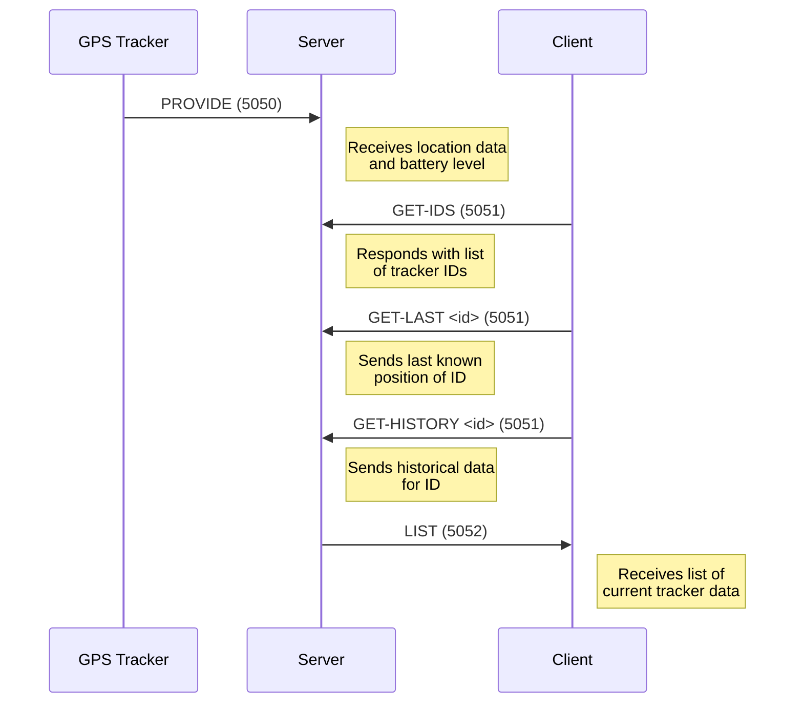
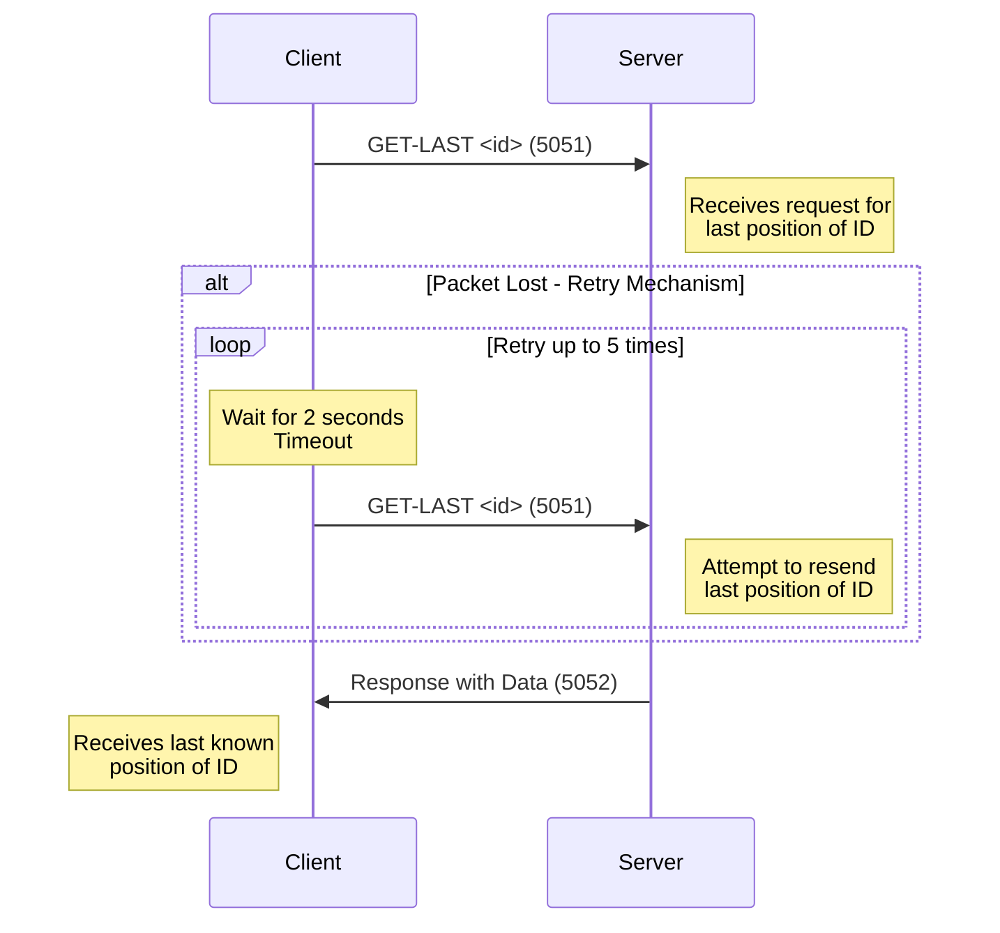

# DAI-2023-24-Practical-work-3 Java UDP programming

* Lucas Lattion
* Romain Humair

# GPS Tracker

## How to build the application

first, clone the repository.

Then, you have two possibilities to build the jar file:
1. IntelliJ
    2. select "Maven Package as JAR file" on top right of IntelliJ
    3. click "Run" button
2. command line in the project folder
    3. ```mvn dependency:resolve clean compile package```


JAR file will be generated in the /target/ folder

## How to use the CLI

minimum parameter is client or server mode

cmd
```
java -jar java-udp-programming-1.0-SNAPSHOT.jar
```
result
```
Please specify either --server or --client option.
```


## Help
cmd
```
java -jar java-udp-programming-1.0-SNAPSHOT.jar -h
```
result
```

```


## Examples

Server : ```java -jar java-udp-programming-1.0-SNAPSHOT.jar -s```
```

```

Client : ```java -jar java-udp-programming-1.0-SNAPSHOT.jar -c```
```

```


### Section 1 - Overview
This protocol outlines the communication for a GPS tracking system using UDP. It involves the exchange of GPS data between trackers, a server, and clients. The system is designed to efficiently transmit real-time and historical location data, including timestamps, latitude, longitude, and battery levels.

- GPS-emitter --> Server <--> Client

### Section 2 - Transport Protocol
The system uses the User Datagram Protocol (UDP) due to its low latency and efficiency. The following UDP ports are designated for communication:
- **Tracker to Server Port:** 5050 (used by GPS trackers to send data to the server)
- **Client to Server Port:** 5051 (used by clients to send requests to the server)
- **Server to Client Port:** 5052 (used by the server to send data to clients)

Server listen on ports: 5050 and 5051.
Client listen on port: 5052.


### Section 3 - Messages
#### GPS-Tracker to Server
The tracker send message 
- **PROVIDE Message:**
   - **Format:** `PROVIDE:ID,timestamp,latitude,longitude,battery_level`
   - **Example:** `PROVIDE:1234,20231218T123000Z,37.7749,-122.4194,85`

#### Server to Client
- **LIST Message:**
   - **Format:** `LIST:{ID,timestamp,latitude,longitude,battery_level},...`
   - **Example:** `LIST:{1234,20231218T123000Z,37.7749,-122.4194,85},{5678,20231218T123015Z,40.7128,-74.0060,78},...`

#### Client to Server
- **GET-IDS Message:**
   - **Format:** `GET-IDS`
   - **Example:** `GET-IDS`
- **GET-LAST Message:**
   - **Format:** `GET-LAST <ID>`
   - **Example:** `GET-LAST 1234`
- **GET-HISTORY Message:**
   - **Format:** `GET-HISTORY <ID>`
   - **Example:** `GET-HISTORY 1234`

### Section 4 - Examples
#### Example 1: Tracker Updating Server
- **Scenario:** A GPS tracker sends its current location and battery status to the server.
- **Message:** `PROVIDE:1234,20231218T123000Z,37.7749,-122.4194,85`
- **UDP Port:** 5050

#### Example 2: Client Requesting Last Known Position
- **Scenario:** A client requests the last known position of tracker ID 1234.
- **Message:** `GET-LAST 1234`
- **UDP Port:** 5051

#### Example 3: Server Sending List of Trackers to Client
- **Scenario:** The server sends a list of current tracker data to a client.
- **Message:** `LIST:{1234,20231218T123000Z,37.7749,-122.4194,85},{5678,20231218T123015Z,40.7128,-74.0060,78},...`
- **UDP Port:** 5052

## Section 5 - Protocol Diagrams

### Normal working diagram case

In this sequence diagram:
- The **GPS Tracker** sends 'PROVIDE' messages to the Server using UDP port 5050.
- The **Client** sends various 'GET-*' requests (like 'GET-IDS', 'GET-LAST', and 'GET-HISTORY') to the Server using UDP port 5051.
- The **Server** responds to the Client with 'LIST' messages using UDP port 5052.

This diagram provides a clear visual representation of the message flow between the GPS trackers, server, and clients in your system.



### Timeout diagram case

In this diagram:
- The **Client** initially sends a 'GET-LAST' request to the **Server** using UDP port 5051.
- If the packet is lost, the client waits for 2 seconds (timeout) and then retries the request.
- This retry mechanism occurs up to 5 times.
- Upon successful receipt of the request, the Server responds with the requested data using UDP port 5052.

This sequence effectively demonstrates how the system handles packet loss with a timeout and retry strategy, ensuring reliability in the data communication process.



### Malformed Message Format

There is no respond to malformed messages. They are just ignored/dropped.

## Edge Cases

Edge cases could include network interruptions, client disconnections, and malformed message formats. Each case should be handled gracefully, with the server providing an appropriate error code and message to the client, or by timing out the connection after a certain period of inactivity.

### Network Interruption

In case of network inturruption, a lost packet is not important for the trackers.

For the client-server communication, in case a packet is lost, there is a timeout of 2 seconds and a trial of 5 times.


## Tool used
- Maven
- Java 17
- Intellij IDEA Ultimate
- GitHub
- Markdown
- ChatGpt
